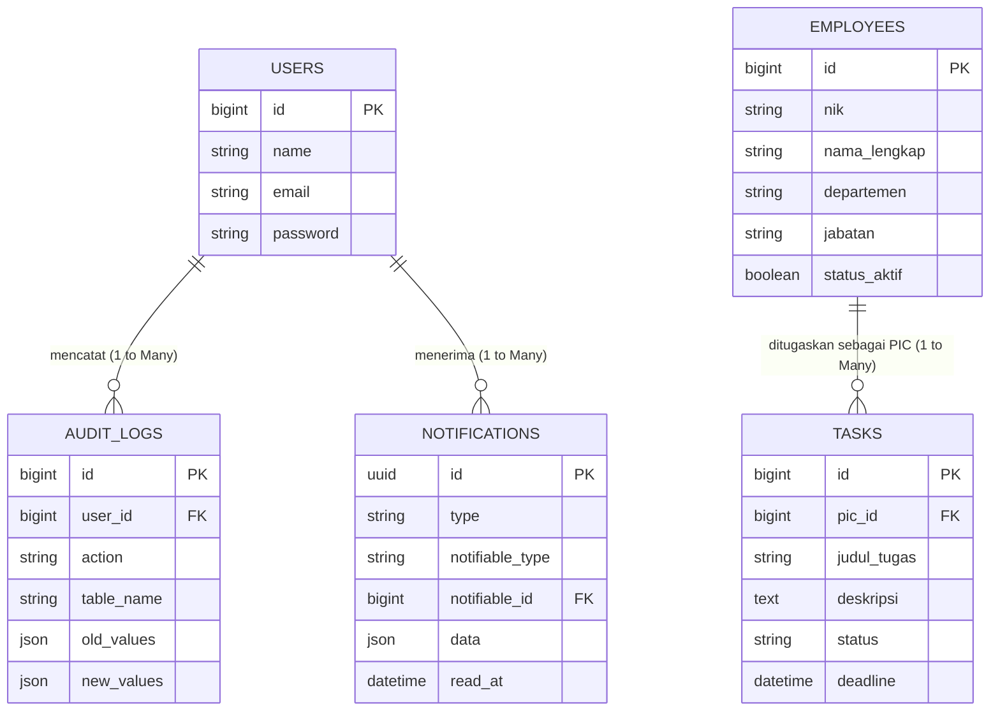

# 🏢 PT Properindo Enviro Tech - Internal Corporate System


Sistem **Enterprise Resource & Task Management** adalah platform internal terpadu yang dirancang untuk mengoptimalkan pengelolaan sumber daya manusia dan memonitor produktivitas operasional lintas departemen di PT Properindo Enviro Tech (PT PET).

Sistem ini memastikan transparansi tugas, pelacakan tenggat waktu secara _real-time_, serta rekam jejak audit yang aman.

---

## ✨ Fitur Utama (MVP)

### 🔐 Autentikasi & Keamanan

- **Portal Otentikasi:** Login dan Register khusus karyawan.
- **Manajemen Akun:** Pengaturan profil dan pembaruan kata sandi.

### 👥 Manajemen Karyawan (HR Module)

- **Dashboard Statistik:** Visualisasi metrik jumlah karyawan.
- **CRUD Data Pegawai:** Pencatatan informasi fundamental (Nama, Posisi, Departemen, Status).
- **Pencarian & Filter:** Filter data berdasarkan departemen dan status aktif.
- **Ekspor Laporan:** Mengunduh data direktori karyawan ke format CSV/Excel.

### 📋 Monitoring Pekerjaan (Task Module)

- **Penciptaan Tugas:** Input pekerjaan baru beserta prioritas dan tenggat waktu (_deadline_).
- **Penugasan PIC:** Mendelegasikan pekerjaan ke _Person in Charge_ spesifik.
- **Pelacakan Progres:** Pembaruan status pekerjaan (_To Do, In Progress, Done_).
- **Notifikasi Pintar:** Peringatan otomatis untuk pekerjaan yang mendekati atau melewati _deadline_.

### 🛡️ Kepatuhan & Audit

- **Audit Log (Histori Aktivitas):** Perekaman jejak perubahan data (Aktor, Waktu, Aksi, Data Lama vs Data Baru) secara transparan.

---

## 💻 Tech Stack

- **Backend:** [Laravel](https://laravel.com/) (PHP)
- **Frontend:** [React.js](https://reactjs.org/)
- **Routing/Bridging:** [Inertia.js](https://inertiajs.com/)
- **Styling:** [Tailwind CSS](https://tailwindcss.com/)
- **Database:** MySQL / PostgreSQL

---

## 🗄️ Arsitektur Basis Data

Sistem ini menggunakan arsitektur relasional dengan struktur entitas utama sebagai berikut:

- `users` - Menyimpan data kredensial login (ID, Nama, Email, Password).
- `employees` - Menyimpan profil operasional karyawan (ID, NIK, Departemen, Jabatan).
- `tasks` - Menyimpan rincian pekerjaan. Berelasi _Many-to-One_ ke tabel `employees` via `pic_id`.
- `audit_logs` - Mencatat log histori aplikasi. Berelasi ke tabel `users` via `user_id`.
- `notifications` - Tabel bawaan sistem untuk menyimpan data notifikasi (seperti peringatan _deadline_) secara _real-time_ untuk setiap _user_.

### Entity Relationship Diagram (ERD)



---

## 🚀 Panduan Instalasi (Local Development)

Ikuti langkah-langkah berikut untuk menjalankan proyek ini di lingkungan lokal Anda.

### Persyaratan Sistem:

- PHP >= 8.1
- Composer
- Node.js & NPM
- MySQL / MariaDB

### Langkah Instalasi:

1. **Clone repositori ini:**

    ```
    git clone https://github.com/muhammadfarrasfajri/staf-it-test-pet.git
    cd staf-it-test-pet
    ```

2. **Instal dependensi Backend (PHP):**

    ```
    composer install
    ```

3. **Instal dependensi Frontend (Node.js):**

    ```
    npm install
    ```

4. **Salin file .env.example menjadi .env dan sesuaikan kredensial database Anda.**

    ```
    cp .env.example .env
    ```

5. **Generate Application Key:**

    ```
    php artisan key:generate
    ```

6. **Migrasi Database:**

    ```
    php artisan migrate
    ```

7. **Jalankan Server Lokal:**

    Buka dua terminal terpisah dan jalankan perintah berikut:

    _Terminal 1 (Backend):_

    ```
    php artisan serve
    ```

    _Terminal 2 (Frontend/Vite):_

    ```
    npm run dev
    ```

8. **Akses Aplikasi:**

    Buka browser dan navigasikan ke

    ```
    http://localhost:8000.
    ```
````
